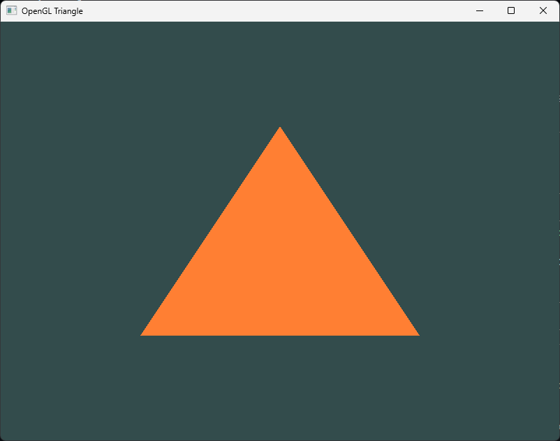

# OpenGL Triangle Example (C99)

A minimal OpenGL example that renders a triangle using modern OpenGL 4.6 and SPIR-V shaders, written in C99. This is a C implementation of the [Learn OpenGL](https://learnopengl.com/Getting-started/Hello-Triangle) tutorial, which was originally written in C++.

## Overview

This minimal OpenGL project demonstrates rendering a triangle using modern OpenGL 4.6 with SPIR-V shaders, implemented in C99. Based on the Learn OpenGL tutorial, it utilizes GLFW for window management, supports debug output, and maintains minimal dependencies. SPIR-V shaders (vertex.glsl and fragment.glsl) are automatically compiled using glslc from the Vulkan SDK. The program initializes GLFW, sets up the OpenGL context, loads shaders, configures vertex buffers, and continuously renders a triangle, handling window resizing and keyboard input throughout.

## Goal

After completing [vulkan-triangle](https://github.com/jonathan-slark/vulkan-triangle), I created this project to explore using OpenGL and Win32 for future game development. The goal was to evaluate their suitability compared to Vulkan. To maintain consistency, I continued using C99 and the MSYS2 environment as in the previous project.

## Postmortem

I initially attempted to create an OpenGL context using Win32, but the process quickly became frustrating. The challenges—such as having to create a dummy context before the real one and limited documentation—led me to switch to GLFW. With GLFW handling the low-level OS intricacies, the setup became much simpler and naturally cross-platform.

I chose to reuse SPIR-V shaders, following the approach from the vulkan-triangle project. Keep in mind that this requires an OpenGL 4.6 capable GPU, which is an important consideration.

Compared to vulkan-triangle, opengl-triangle not only has significantly fewer lines of code but also abstracts much of the hardware complexity. This makes it a more accessible option if you don't need the full power and granularity of Vulkan.

## Building

The following MSYS2 packages are required:
- make
- mingw-w64-ucrt-x86_64-gcc
- mingw-w64-ucrt-x86_64-glfw

The project uses the `glslc.exe` compiler from the Vulkan SDK for shader compilation.

## License

This project is licensed under the MIT License - see `LICENSE.txt`.
